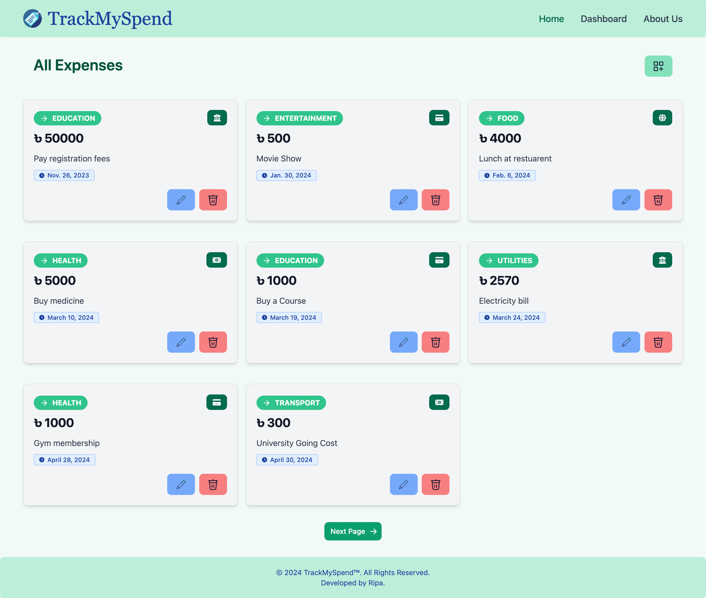
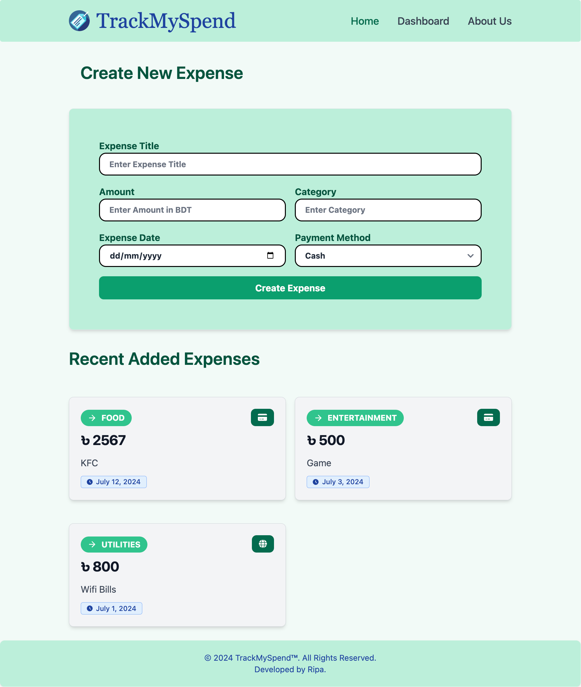
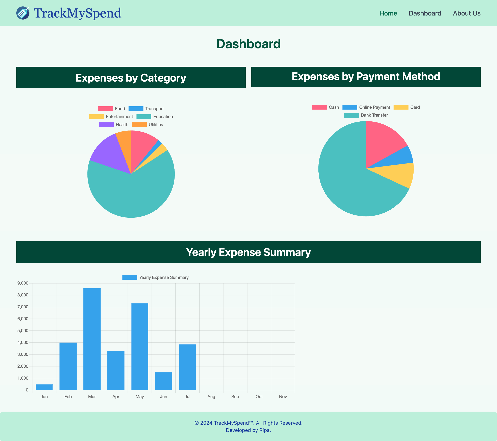
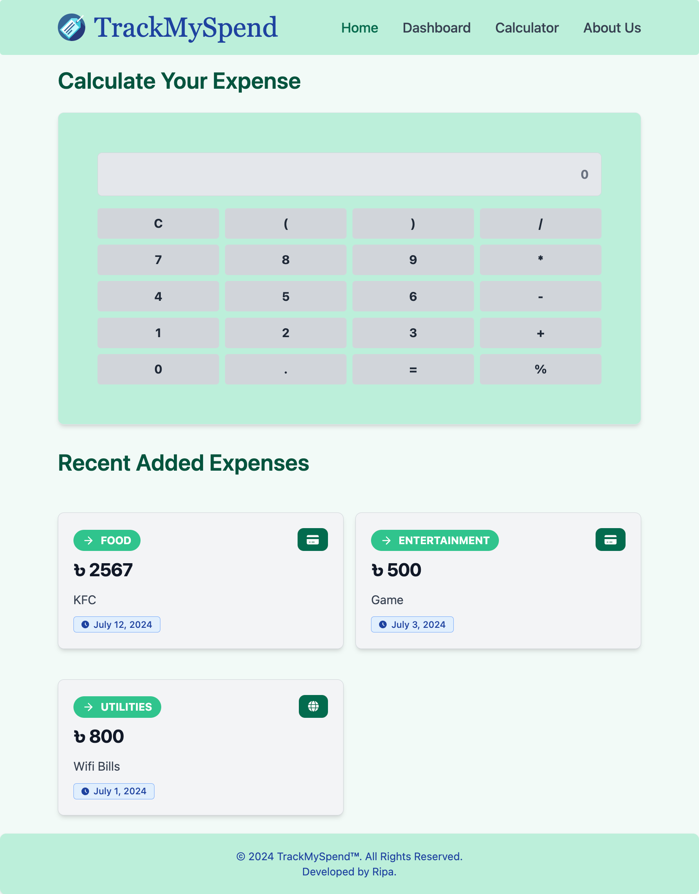

# TrackMySpend

This project is an Expense Tracker application built with Django, Tailwind CSS, Flowbite, Lordicon, and Chart.js. It allows users to  update, delete and view their expenses categorized by various types and payment methods. Users can also visualize their expense data through interactive charts.

### Project Overview

- **Home Page**: Lists expenses with pagination and includes a form to add new expenses.
- **Expense Form**: Allows users to add, update or delete expenses.
- **Dashboard**: Displays yearly expense summaries, expenses by category, and expenses by payment method using Chart.js.
- **Calculator Page:** Provides an interface for users to calculate and manage their expenses efficiently.

Here are some screenshots to give a visual representation of the application:

#### Home Page


#### Expense Form 


#### Dashboard


#### Calculator Page



### Installation

Before starting, ensure you have Python, Django, and Node.js installed on your system.

### Development Setup

1. **Clone the repository**:
   ```bash
   git clone https://github.com/ripa01/TrackMySpend.git
   cd spendTracker
   ```

2. **Setup Virtual Environment** (optional but recommended):
   ```bash
   python -m venv env
   source env/bin/activate   # On Windows: .\env\Scripts\activate
   ```

3. **Install Python Dependencies**:
   ```bash
   pip install -r requirements.txt
   ```

4. **Compile Tailwind CSS**:
   ```bash
   npx tailwindcss -i ./static/src/input.css -o ./static/src/output.css --watch
   ```

5. **Run Django Development Server**:
   ```bash
   python manage.py runserver
   ```

6. **Access the Application**:
   Open your web browser and go to `http://localhost:8000` to view the application.


### Technologies Used

- **Backend**: Django
- **Frontend**: Tailwind CSS, Flowbite, Lordicon, Chart.js
- **Development Tools**: npm, concurrently

### Scripts

In the project's `package.json`, the following scripts are defined:

```json
{
  "scripts": {
    "start": "concurrently \"npx tailwindcss -i ./static/src/input.css -o ./static/src/output.css --watch\" \"python manage.py runserver\""
  }
}
```

To start the development server and watch Tailwind CSS changes, run:
```bash
npm start
```

This command concurrently watches for changes in Tailwind CSS files and starts the Django development server.


